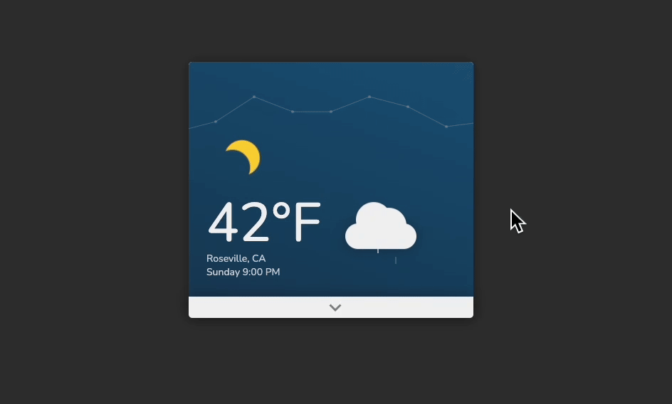

# **Project 3. Weather Card**

## **Overview**
This project showcases an animated weather card interface built with **Pug** and **Sass**. All weather icons are constructed using basic SVG shapes, featuring smooth animations and interactive effects.

**Live Demo:** [View on CodePen](https://codepen.io/WinnyChang-Yun/pen/JoPepXQ)

## **Tech Stack**
- **Pug**: HTML preprocessor for clean, nested markup structure
- **Sass**: CSS preprocessor for advanced styling with variables and mixins

## **Key Components**
- **Animated Elements**
  - Floating clouds with rainfall effects
  - Gradual sky color transitions
  - Moon phase transitions

- **Interactive Elements**
  - Forecast panel expanded on hover
  - Temperature chart toggled on click
  - Smooth state transitions

## **Future Improvements**
- Expand weather condition icons and animations
- Integrate real-time weather data
- Add temperature unit conversion
- Optimize mobile responsiveness

## **Author**
**Winny Chang**